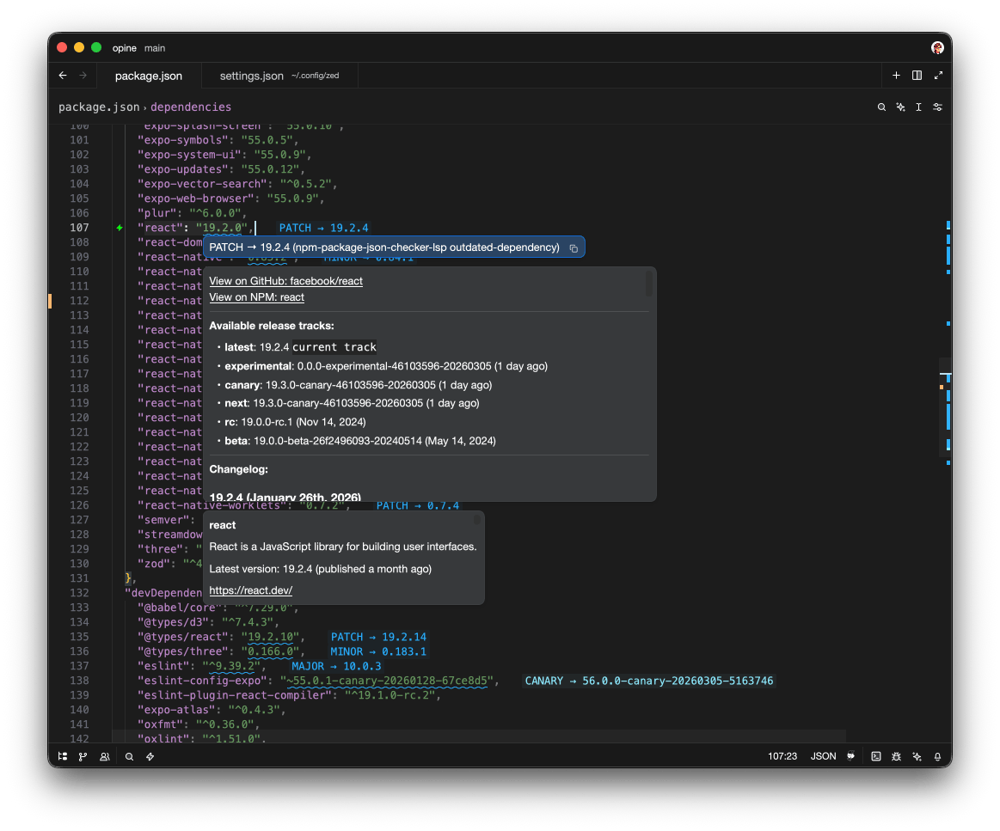
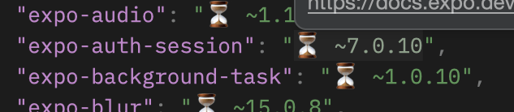

<p align="center">
    
    <h3 align="center">NPM Update Checker for <a href="https://zed.dev/">Zed IDE</a></h3>
    <p align="center">
	    Show outdated npm packages and changelogs in package.json files minimalistically using a Rust LSP.
        <br><br>
        <a href="https://github.com/e-simpson/zed-npm-update-checker"></a>
    </p>
    </p>
</p>



### Features

- 📥 Highlights outdated packages in package.json files
- 🔍 Changelog between current version and latest version (intelligently parsing GitHub releases and/or CHANGELOG.md directly - no api calls)
- 🔧 Offers auto-complete to update the package
- 📚 Distinguishes between major, minor, and patch updates

### Loading Indicator

For an inlay loading indicator, enable inlay hints in Zed:
```json
// settings.json
{
  "inlay_hints": {
    "enabled": true
  }
}
```

### Install via Zed Extensions
1. Open Zed
2. `cmd+shift+p` and select *zed: extensions*
3. Search/select *NPM Update Checker* and Install

### Manual Installation
1. Clone this repository
2. Build the LSP:
   ```bash
   cargo build --release -p npm-package-json-checker-lsp
   cp target/release/npm-package-json-checker-lsp .
   ```
3. In Zed: Command Palette → "zed: install dev extension" → select this directory

### Project Structure

```
├── extension.toml       # Zed extension manifest
├── src/lib.rs           # WASM extension (registers LSP)
└── lsp/                 # LSP binary
    └── src/
        ├── main.rs      # Entry point
        ├── lsp.rs       # tower-lsp server
        ├── parser.rs    # package.json parsing
        └── registry.rs  # npm registry + GitHub client
```

### Defaults

- Cache TTL: 5 minutes
- Concurrent requests: 10
- Request timeout: 15 seconds
- Changelog priortiy: GitHub releases > CHANGELOG.md
