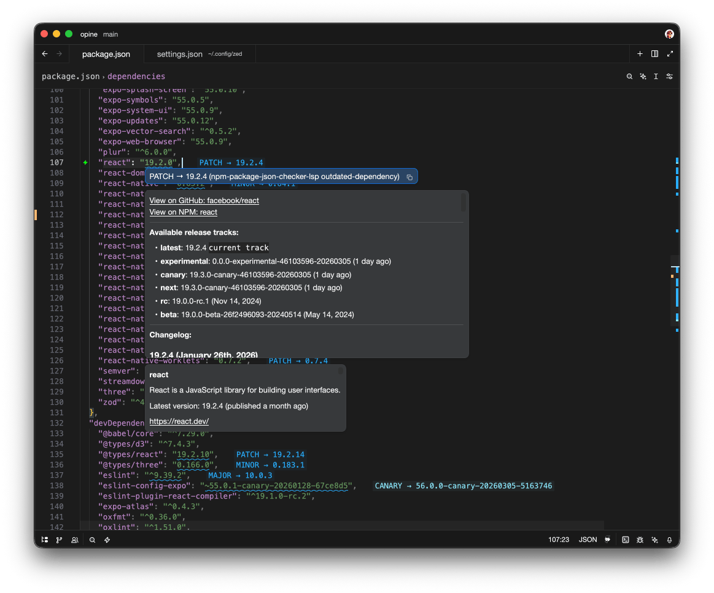
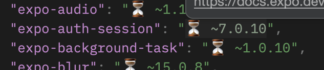

<p align="center">
    
    <h3 align="center">NPM Update Checker for <a href="https://zed.dev/">Zed IDE</a></h3>
    <p align="center">
	    Highlights outdated npm packages and changelogs in package.json files minimalistically using a Rust LSP.
        <br><br>
        <a href="https://github.com/e-simpson/zed-npm-update-checker"></a>
    </p>
    </p>
</p>



### Features
- 📥 Highlights outdated packages in package.json
- 🔍 Changelog between current version and latest version 
    - Parses and combines GitHub releases and/or CHANGELOG.md
    - Shows changes from current to latest if possible
    - Goes direct without API calls with rate limits    
- 🔧 Offers auto-complete to update the package
    - Shows available release tracks
    - Includes fallback update targets from the current track (older than latest, newer than current)
- 📚 Distinguishes between release tracks (major/minor/patch/canary/nightly/beta/alpha/experimental)

### Loading Indicator

For an inlay loading indicator, enable inlay hints in Zed:
```json
// settings.json
{
  "inlay_hints": {
    "enabled": true
  }
}
```

### Install via Zed Extensions
1. Open Zed
2. `cmd+shift+p` and select *zed: extensions*
3. Search/select *NPM Update Checker* and Install

### Manual Installation
1. Clone this repository
2. Build the LSP:
   ```bash
   cargo build --release -p npm-package-json-checker-lsp
   cp target/release/npm-package-json-checker-lsp .
   ```
3. In Zed: Command Palette → "zed: install dev extension" → select this directory

### Misc
- Caches packages and attempts to not re-pull them if it doesn't need to

### Configuration

Configure the extension in your Zed `settings.json` under `lsp.npm-package-json-checker-lsp.settings`.

**Make sure to restart Zed or the LSP server after making changes.**

| Key | Type | Default | Description |
| --- | --- | --- | --- |
| `registry_url` | `string` | `"https://registry.npmjs.org"` | Registry base URL used for package metadata lookups (manual override; `.npmrc`/env discovery is not used). |
| `cache_ttl_seconds` | `number` | `300` | Cache TTL in seconds (`0` disables cache reuse). |
| `max_concurrent_requests` | `number` | `10` | Max concurrent registry requests (minimum `1`). |
| `request_timeout_seconds` | `number` | `15` | HTTP timeout in seconds (minimum `1`). |
| `show_experimental_tracks` | `boolean` | `false` | Show extra hint diagnostics for newer non-current tracks (including experimental/pre-release tracks). |
| `recent_releases_in_code_actions` | `number` | `3` | Number of fallback "recent release" code actions on the current track (`0` disables them). |
| `date_tag_mode` | `"date" \| "timeago" \| "date+timeago"` | `"date+timeago"` | Controls how release dates are rendered in labels/changelog headers. |
| `date_format` | `string` | `"%d/%m/%Y"` | `chrono` date format string used when `date_tag_mode` includes date output. |

Default settings snippet:

```json
{
  "lsp": {
    "npm-package-json-checker-lsp": {
      "settings": {
        "registry_url": "https://registry.npmjs.org",
        "cache_ttl_seconds": 300,
        "max_concurrent_requests": 10,
        "request_timeout_seconds": 15,
        "show_experimental_tracks": false,
        "recent_releases_in_code_actions": 3,
        "date_tag_mode": "date+timeago",
        "date_format": "%d/%m/%Y"
      }
    }
  }
}
```
